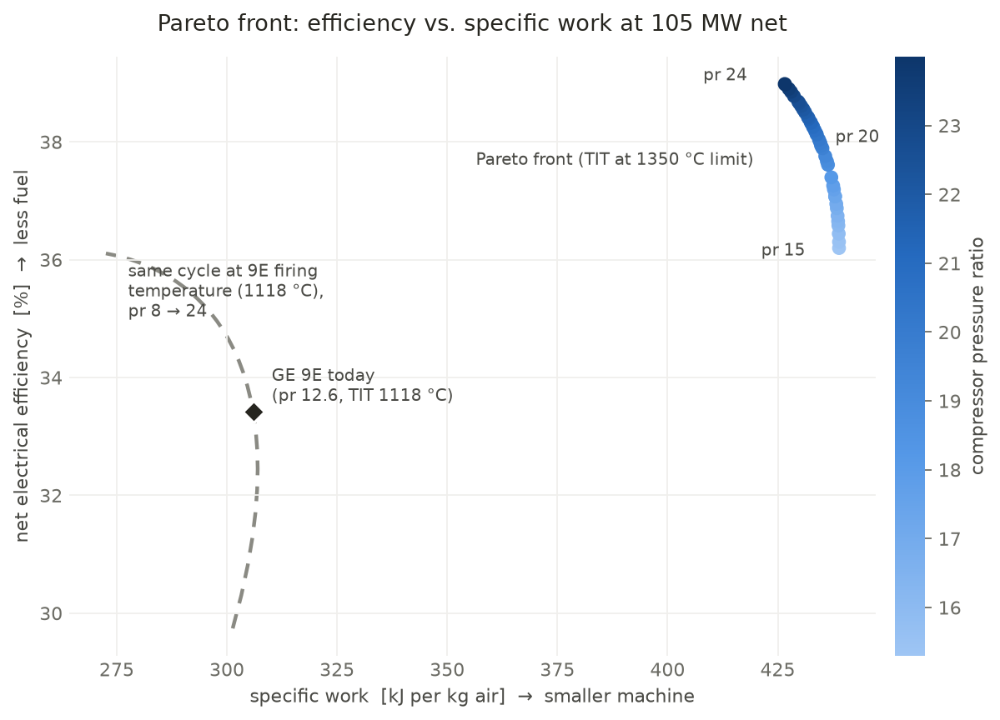

# Simple-Cycle Gas Turbine Power Plant Model (TESPy)

A working thermodynamic model of a simple-cycle gas turbine power plant
(Brayton cycle), built with [TESPy](https://tespy.readthedocs.io).
The code is in [`simple_gas_turbine.py`](simple_gas_turbine.py).

**The model is set up with real plant data: GE Frame 9E, site full load
105 MW, exhaust temperature 560–575 °C (full load) / 440–450 °C (part
load).** See section 4 for the validation results.

```
                 fuel (5)
                    |
                    v
 air (1)  [COMPRESSOR] --(2)--> [COMBUSTOR] --(3)--> [TURBINE] --(4)--> stack
               ^                                          |
               |__________________ shaft _________________|
                                     |
                                [GENERATOR] ---> grid (net MW)
```

---

## 1. How to run it (even from your phone)

The GitHub app can only **edit** files, it cannot run Python.
Easiest way to run from a phone: **Google Colab** (free, works in browser).

1. Open [colab.research.google.com](https://colab.research.google.com) → New notebook.
2. First cell:
   ```
   !pip install tespy
   ```
3. Second cell: paste the whole content of `simple_gas_turbine.py` and run.

On a PC:

```bash
pip install tespy
python simple_gas_turbine.py
```

---

## 2. Which portion of the code does which part (teaching guide)

The script is divided into 7 numbered STEPs. Here is what each one is,
why it is needed, and what plant data goes into it.

### STEP 1 — Imports
**What it is:** loads the TESPy building blocks.
**Required from you:** nothing.
- `Network` = the whole plant (holds everything, runs the solver)
- `Source` / `Sink` = where fluid enters (air, fuel) and leaves (exhaust)
- `Compressor`, `DiabaticCombustionChamber`, `Turbine` = the 3 real machines
- `PowerBus` = the shaft, `Generator` = the alternator, `PowerSink` = the grid

### STEP 2 — Create the Network
**What it is:** creates the empty plant and sets the units (bar, °C).
**Required from you:** nothing — but pick the units your DCS uses so you can
type numbers directly from your screens.

### STEP 3 — Create the components
**What it is:** one Python object per physical machine.
**Required from you:** nothing yet (names are just labels).

### STEP 4 — Connections
**What it is:** the "pipes" between machines, and the shaft/cables.
**Required from you:** nothing — but understand the numbering, because all
plant data is attached to these points:

| Connection | Physical location in your plant |
|---|---|
| `c1` (1) | air intake filter house → compressor inlet |
| `c2` (2) | compressor discharge → combustor |
| `c3` (3) | combustor exit → turbine inlet (firing temperature) |
| `c4` (4) | turbine exhaust → stack |
| `c5` (5) | fuel gas skid → combustor |
| `e1..e4` | turbine shaft → compressor / generator → grid |

### STEP 5 — Plant data (★ THIS is where YOUR real data goes)
Every `set_attr(...)` line marked with ★ must be replaced with your values:

| Code line | Data needed | Where to get it in a real plant |
|---|---|---|
| `c1.set_attr(p=, T=)` | ambient pressure & temperature | site weather station / DCS |
| `c5.set_attr(fluid=)` | fuel gas composition (mass fractions, sum = 1) | gas supplier lab report / chromatograph |
| `c5.set_attr(p=, T=)` | fuel gas pressure & temperature | fuel skid instruments |
| `comp.set_attr(pr=)` | compressor pressure ratio = p2 ÷ p1 | OEM datasheet, or DCS discharge-pressure sensor |
| `comp.set_attr(eta_s=)` | compressor isentropic efficiency | OEM / performance test (typ. 0.82–0.88) |
| `combust.set_attr(pr=)` | combustor pressure drop (0.97 = 3 % loss) | OEM datasheet |
| `combust.set_attr(eta=)` | combustion efficiency (heat loss) | OEM datasheet (typ. 0.98–0.995) |
| `c4.set_attr(T=)` | **measured exhaust temperature** — the model then *calculates* the TIT (which the DCS cannot show) | DCS exhaust thermocouples |
| `c4.set_attr(p=)` | exhaust pressure ≈ ambient | leave ≈ 1.013 bar |
| `turb.set_attr(eta_s=)` | turbine isentropic efficiency | OEM / performance test (typ. 0.85–0.92) |
| `gen.set_attr(eta=)` | generator efficiency | OEM datasheet (typ. 0.985) |
| `e4.set_attr(E=)` | net electrical output in **watts** (50 MW → `50e6`) | your energy meter / DCS MW reading |

**Rule of thumb about "how many values to give":** TESPy needs exactly as many
specifications as unknowns. If you set one value twice in different ways
(over-determined) or forget one (under-determined), the solver will tell you.
The set above is exactly right — if you want to *fix the air mass flow*
instead of the net power, add `c1.set_attr(m=...)` and **remove**
`e4.set_attr(E=...)`. Always one in, one out.

### STEP 6 — Solve
**What it is:** `nw.solve(mode="design")` runs a Newton solver on all the
energy/mass balances. Converged = residual around `1e-6` in the log.
**Required from you:** nothing, just read the log.

### STEP 7 — Results / KPIs
**What it is:** prints the numbers you should compare with the real plant:
net MW, fuel heat input, efficiency, air & fuel mass flow, compressor
discharge T/p, exhaust temperature.

---

## 3. How to validate against your real plant data

1. Enter your known data in STEP 5 (ambient, fuel, pr, TIT, net MW).
2. Run the model.
3. Compare the *calculated* values with your DCS:
   - **Exhaust temperature (c4)** — best single check. If model is too hot,
     your real `eta_s` (turbine) is probably higher, or TIT lower.
   - **Compressor discharge temperature (c2)** — checks compressor `eta_s`.
   - **Fuel flow (c5)** — checks combustor efficiency and TIT together.
4. Adjust `eta_s`, `pr`, `TIT` a little at a time until model ≈ plant.
   Then you have a validated model you can use for what-if studies
   (hot day performance, part load, degradation, upgrades).

## 4. Results with the real GE Frame 9E data

Inputs given to the model: pressure ratio 12.6 (9E datasheet), ambient
30 °C, net load, and the **measured** exhaust temperature. The model then
*calculates* the turbine inlet temperature (TIT) and everything else.

**Full load — 105 MW, exhaust 565 °C (measured):**

```
Net electrical output      :     105.00 MW   (input, DCS)
Fuel heat input (LHV)      :     314.18 MW
Net electrical efficiency  :      33.42 %
Air mass flow              :     343.33 kg/s
Fuel mass flow             :       6.542 kg/s
Compressor discharge T     :      394.2 degC
Compressor discharge p     :      12.76 bar
CALCULATED TIT             :     1117.8 degC
Exhaust temperature        :      565.0 degC  (input, DCS)
```

**Validation — why we can trust this model:**
- Calculated TIT = **1117.8 °C**, and the published GE 9E firing
  temperature is **~1124 °C** → within 6 °C, without ever telling the
  model what a 9E fires at.
- Efficiency = **33.4 %**, and the 9E simple-cycle ISO rating is
  **~33.8 %** → matches (slightly lower is correct on a 30 °C day).

**Part load — 70 MW, exhaust 445 °C (measured):**

```
Net electrical output      :      70.00 MW   (input, DCS)
Fuel heat input (LHV)      :     224.03 MW
Net electrical efficiency  :      31.25 %
Fuel mass flow             :       4.665 kg/s
CALCULATED TIT             :      938.7 degC
Exhaust temperature        :      445.0 degC  (input, DCS)
```

The lower exhaust temperature at part load is reproduced by the machine
turning its firing temperature down (1118 → 939 °C) — exactly how a 9E
behaves below the temperature-control range. Note the part-load run keeps
compressor `pr`/`eta_s` constant (ignores IGV modulation); for precise
part-load work use offdesign mode (section 6).

**Numbers you can still improve with more plant data:**
- **Fuel flow**: if your DCS shows gas flow (kg/s or Nm³/h), compare with
  the calculated 6.54 kg/s — this is the single best check of the
  efficiency chain.
- **Compressor discharge T & p (CPD)**: compare with the calculated
  394 °C / 12.8 bar to tune `comp.eta_s`.
- **Air flow**: a clean new 9E moves ~410 kg/s exhaust flow at ISO; the
  model computed 343 kg/s from your 105 MW — if your unit's measured flow
  differs, the component efficiencies need tuning (aging/fouling shows up
  here).

## 5. Common errors and fixes

| Error / symptom | Cause | Fix |
|---|---|---|
| "network is over-determined" | you set the same thing twice (e.g. both net power `E` and air mass flow `m`) | remove one specification |
| "network is under-determined" | a required value missing | add the missing `set_attr` |
| fuel pressure error in combustor | `c5` pressure below compressor discharge | set fuel `p` higher than `p1 × pr` |
| solver does not converge | unrealistic inputs (e.g. TIT too low for the pressure ratio) | start from the defaults, change one value at a time |
| composition error | fluid fractions don't sum to 1 | fix the fractions |

## 6. Next steps you can build on top of this

- **Part-load / offdesign:** save the design (`nw.save(...)`) and rerun with
  `nw.solve("offdesign", design_path=...)` using compressor/turbine
  characteristic curves.
- **Combined cycle:** add a heat-recovery steam generator (HeatExchanger)
  on connection 4.
- **Optimization:** done — see section 7 and
  [`optimize_pr_tit.py`](optimize_pr_tit.py). (The TESPy
  [optimization tutorial](https://tespy.readthedocs.io/en/main/integration/optimization.html)
  shows the same idea with pygmo instead of pymoo.)

---

## 7. Multi-objective optimization (pymoo, NSGA-II, Pareto front)

`optimize_pr_tit.py` lets the NSGA-II genetic algorithm vary two design
variables and maximize two objectives at once:

| | Variable / objective | Range / meaning |
|---|---|---|
| x1 | compressor pressure ratio | 8 – 24 |
| x2 | turbine inlet temperature (TIT) | 950 – 1350 °C |
| f1 | net electrical efficiency [%] | maximize → less fuel per MWh |
| f2 | specific work [kJ/kg air] | maximize → smaller, cheaper machine |

Because no single design wins both objectives, the result is a **Pareto
front** — the set of best possible compromises
(`pareto_front.png` / `pareto_front.csv`, 40 × 30 = 1200 TESPy simulations).

**How the code is structured:**
- **STEP 1** — the same 9E model wrapped in `build_network()` +
  `evaluate(nw, pr, tit)`. TIT is now an *input* (the optimizer picks it),
  so the exhaust temperature becomes a *result*.
- **STEP 2** — `GasTurbineProblem(ElementwiseProblem)`: tells pymoo the
  bounds and returns the two objectives (negated, because pymoo always
  minimizes). A non-converging design gets a huge penalty so the algorithm
  avoids it.
- **STEP 3** — run `NSGA2(pop_size=40)` for 30 generations.
- **STEP 4/5** — print/save the front and plot it.

**What the result teaches:**
1. **TIT is pushed to its upper bound (1350 °C) on every Pareto point.**
   Higher firing temperature improves *both* objectives, so there is no
   trade-off in TIT — it is limited only by blade materials/cooling. This
   is exactly why every new engine generation (9E → 9F → 9H) is mainly a
   firing-temperature increase.
2. **The real trade-off is the pressure ratio** (front spans pr 15 → 24):
   pr 15 gives the smallest machine (439 kJ/kg, 36.2 % efficiency), pr 24
   the best fuel economy (39.0 %, 427 kJ/kg).
3. **Your 9E today** (pr 12.6, TIT 1118 °C → 33.4 %, 306 kJ/kg) sits below
   the front because its TIT is materials-limited. The gray dashed curve in
   the chart is the same cycle held at 1118 °C: even at pr 24 it reaches
   only ~36 % — so ~⅔ of the gap to the front is technology (TIT), not
   design choice. GE's pr = 12.6 lies near the *maximum specific work* for
   1118 °C — a deliberate choice for a compact single-shaft machine.


